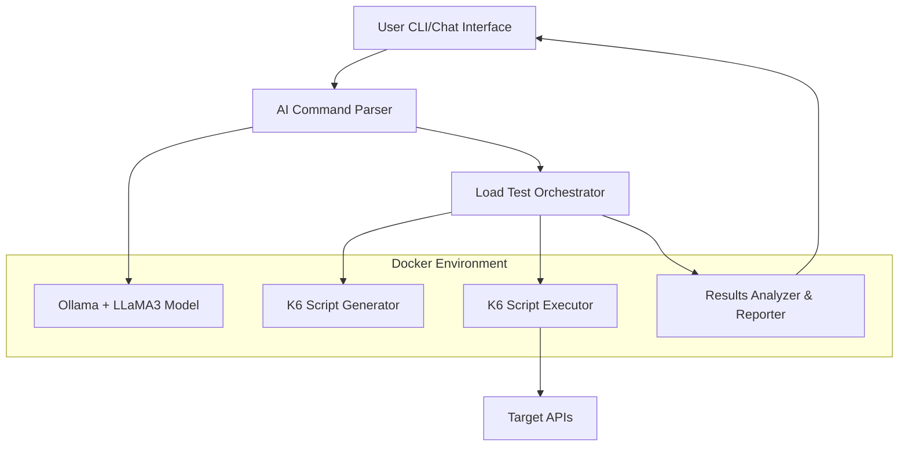

# Design Document

## Overview

StressMaster is a local-first application that combines natural language processing with load testing capabilities. The system uses a containerized architecture with three main components: an AI service powered by Ollama/LLaMA3, a load test orchestrator, and a K6 script executor. Users interact through a CLI/chat interface that accepts natural language commands, which are then parsed by the AI to generate and execute load test scripts.

## Architecture

### High-Level Architecture



### Container Architecture

The system runs in a multi-container Docker setup:

1. **AI Service Container**: Runs Ollama with LLaMA3 model
2. **Main Application Container**: Contains the orchestrator, CLI interface, and business logic
3. **K6 Runner Container**: Executes load test scripts in isolation
4. **Shared Volume**: For script storage and result sharing between containers

## Components and Interfaces

### 1. CLI/Chat Interface

**Purpose**: Provides user interaction layer for natural language input and result display.

**Key Features**:

- Interactive command-line interface with chat-like experience
- Real-time feedback during test execution
- Result visualization and export capabilities
- Command history and session management

**Interface**:

```typescript
interface CLIInterface {
  startSession(): void;
  processCommand(input: string): Promise<TestResult>;
  displayResults(results: TestResult): void;
  exportResults(results: TestResult, format: ExportFormat): void;
}
```

### 2. AI Command Parser

**Purpose**: Interprets natural language commands and extracts structured load test parameters.

**Key Features**:

- Integration with Ollama API for LLaMA3 model access
- Prompt engineering for consistent parsing results
- Validation and error handling for ambiguous commands
- Context awareness for multi-step scenarios

**Interface**:

```typescript
interface CommandParser {
  parseCommand(naturalLanguageInput: string): Promise<LoadTestSpec>;
  validateSpec(spec: LoadTestSpec): ValidationResult;
  suggestCorrections(input: string, errors: string[]): string[];
}
```

### 3. Load Test Orchestrator

**Purpose**: Coordinates the entire load testing workflow from spec generation to result analysis.

**Key Features**:

- Workflow management for complex multi-step scenarios
- State management for chained requests and data correlation
- Progress tracking and real-time updates
- Error recovery and retry mechanisms

**Interface**:

```typescript
interface LoadTestOrchestrator {
  executeLoadTest(spec: LoadTestSpec): Promise<TestResult>;
  monitorProgress(): Observable<ProgressUpdate>;
  cancelTest(testId: string): Promise<void>;
  getTestHistory(): TestResult[];
}
```

### 4. K6 Script Generator

**Purpose**: Converts structured load test specifications into executable K6 JavaScript code.

**Key Features**:

- Template-based script generation
- Dynamic payload generation with variable substitution
- Support for various HTTP methods and content types
- Advanced scenarios including think time and data correlation

**Interface**:

```typescript
interface ScriptGenerator {
  generateScript(spec: LoadTestSpec): K6Script;
  generatePayloadTemplate(payloadSpec: PayloadSpec): PayloadTemplate;
  validateScript(script: K6Script): ValidationResult;
}
```

### 5. K6 Script Executor

**Purpose**: Runs generated K6 scripts and collects performance metrics.

**Key Features**:

- Containerized execution environment
- Resource monitoring and limits
- Real-time metrics collection
- Result aggregation and formatting

**Interface**:

```typescript
interface ScriptExecutor {
  executeScript(script: K6Script): Promise<RawResults>;
  monitorExecution(): Observable<ExecutionMetrics>;
  stopExecution(): Promise<void>;
}
```

### 6. Results Analyzer & Reporter

**Purpose**: Processes raw test results and generates comprehensive reports with AI-powered insights.

**Key Features**:

- Statistical analysis (percentiles, averages, distributions)
- Performance bottleneck identification
- AI-powered recommendations using LLaMA3
- Multiple export formats (JSON, CSV, HTML)

**Interface**:

```typescript
interface ResultsAnalyzer {
  analyzeResults(rawResults: RawResults): AnalyzedResults;
  generateRecommendations(results: AnalyzedResults): string[];
  exportReport(results: AnalyzedResults, format: ExportFormat): string;
}
```

## Data Models

### LoadTestSpec

```typescript
interface LoadTestSpec {
  id: string;
  name: string;
  description: string;
  testType: "spike" | "stress" | "endurance" | "volume" | "baseline";

  requests: RequestSpec[];
  loadPattern: LoadPattern;
  duration: Duration;

  // For multi-step scenarios
  workflow?: WorkflowStep[];
  dataCorrelation?: CorrelationRule[];
}

interface RequestSpec {
  method: HttpMethod;
  url: string;
  headers?: Record<string, string>;
  payload?: PayloadSpec;
  validation?: ResponseValidation[];
}

interface LoadPattern {
  type: "constant" | "ramp-up" | "spike" | "step";
  virtualUsers?: number;
  requestsPerSecond?: number;
  rampUpTime?: Duration;
  plateauTime?: Duration;
}

interface PayloadSpec {
  template: string;
  variables: VariableDefinition[];
}

interface VariableDefinition {
  name: string;
  type:
    | "random_id"
    | "uuid"
    | "timestamp"
    | "random_string"
    | "sequence"
    | "custom";
  parameters?: Record<string, any>;
}
```

### TestResult

```typescript
interface TestResult {
  id: string;
  spec: LoadTestSpec;
  startTime: Date;
  endTime: Date;
  status: "completed" | "failed" | "cancelled";

  metrics: PerformanceMetrics;
  errors: ErrorSummary[];
  recommendations: string[];

  rawData: RawResults;
}

interface PerformanceMetrics {
  totalRequests: number;
  successfulRequests: number;
  failedRequests: number;

  responseTime: {
    min: number;
    max: number;
    avg: number;
    p50: number;
    p90: number;
    p95: number;
    p99: number;
  };

  throughput: {
    requestsPerSecond: number;
    bytesPerSecond: number;
  };

  errorRate: number;
}
```

## Error Handling

### AI Parsing Errors

- **Ambiguous Commands**: Provide clarifying questions and suggestions
- **Unsupported Features**: Graceful degradation with alternative approaches
- **Model Unavailability**: Fallback to rule-based parsing for common patterns

### Load Test Execution Errors

- **Network Failures**: Retry mechanisms with exponential backoff
- **Target API Errors**: Distinguish between test-related and API-related issues
- **Resource Constraints**: Automatic scaling down and warning messages

### Container Management Errors

- **Ollama Service Failures**: Automatic restart and health checks
- **K6 Container Issues**: Clean container recreation and state recovery
- **Volume Mount Problems**: Validation and automatic directory creation

## Testing Strategy

### Unit Testing

- **AI Parser**: Mock Ollama responses for consistent testing
- **Script Generator**: Template validation and output verification
- **Results Analyzer**: Statistical calculation accuracy
- **Data Models**: Serialization and validation logic

### Integration Testing

- **End-to-End Workflows**: Complete command-to-result testing
- **Container Communication**: Inter-service API testing
- **K6 Script Execution**: Generated script functionality validation
- **Error Scenarios**: Failure mode and recovery testing

### Performance Testing

- **Parser Performance**: Response time under various command complexities
- **Script Generation Speed**: Large specification handling
- **Memory Usage**: Container resource consumption monitoring
- **Concurrent Execution**: Multiple simultaneous load tests

### User Acceptance Testing

- **Natural Language Variety**: Different phrasing for same intent
- **Complex Scenarios**: Multi-step workflow validation
- **Result Interpretation**: Report clarity and usefulness
- **CLI Usability**: Interactive experience quality

## Implementation Considerations

### Docker Configuration

- Use multi-stage builds for optimized container sizes
- Implement health checks for all services
- Configure resource limits to prevent system overload
- Use Docker Compose for easy local deployment

### Ollama Integration

- Implement connection pooling for API efficiency
- Cache common parsing results to reduce model calls
- Use structured prompts with examples for consistent output
- Handle model loading time during initial startup

### K6 Script Optimization

- Generate modular scripts for reusability
- Implement efficient data correlation mechanisms
- Use K6's built-in metrics for comprehensive reporting
- Support custom metrics for domain-specific measurements

### Security Considerations

- Validate all user inputs to prevent injection attacks
- Sanitize generated K6 scripts before execution
- Implement rate limiting for AI model calls
- Use read-only containers where possible
